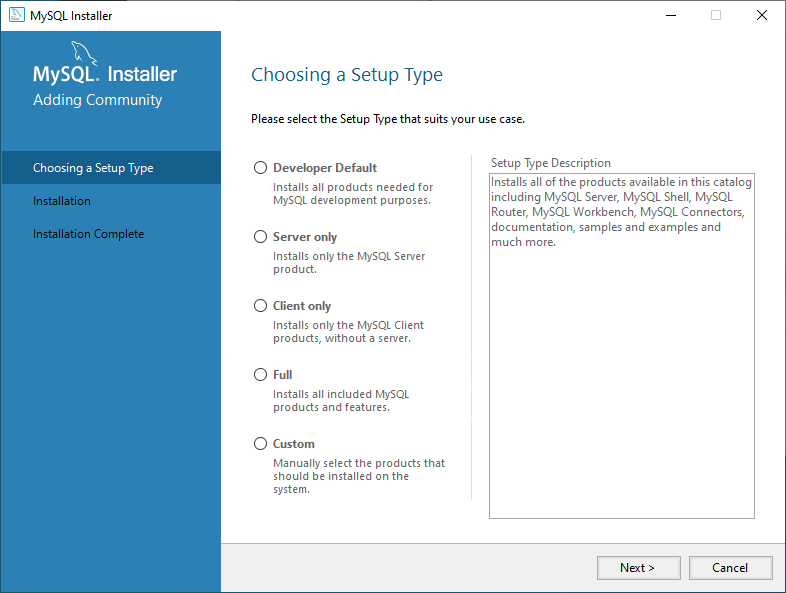

# How to connect Py to MySql

## # 1. Introduction.

___

Hello, I Will Teach You How To Connect Python With MySql Using MySql Server Or Other Servers (XAMPP or WAMPSERVER)

You Need To Install Some Requirements.

## # 2 Downloading MySql.

I Recommend you to install the [MySql Community Server](https://dev.mysql.com/downloads/mysql/), because with only this download, you can install everything from MySQL, like server and the workbench, it should appear like this:



You Can Choose It, if its full or Custom, but i recommend using custom, and install the MySql Server And MySql Workbench, if you want to use other server like XAMPP or smth like that, you dont need it.

## # 2.1 Installing The Server (Optional).

You Can Download [WampServer](https://www.wampserver.com) or [XAMPP](https://www.apachefriends.org/pt_br/download.html), depending of the computer, both will work, after installing, start the mysql server and you are ready!

And if you want to test it, go to http://localhost/phpmyadmin, if it opens a tab the server is online.

## # 3 Dependencies and Coding.

First of all we need to import the Requiriments, that is `mysql-connector-python`:

```shell
pip install mysql-connector-python
```

now starting the code!

```python
import mysql.connector # Import The Mysql Connector
```

if you want to, you can save your mysql information in a `config.json` file, thats what i made because this project is public and i dont want to share private information.

Here is the code to connect to the json file or json string.

```py
import json # Json Library (dont forget it lol)

f = open('config.json') # Opens The File
data = json.load(f) # Loads The Opened File
```

And here is the code u can put on the `config.json` file

```json
{
    "host": "", // Your Host Here
    "user": "", // Your Mysql User Here
    "password": "" // Your MySQL Password here (if none, value=null)
}
```
Now we need to connect it on the python file, its like this:

```python
mydb = mysql.connector.connect(
    host=data['host'],
    user=data['user'],
    password=data['password']
)
```

Now to test and finish the code, lets make a if statement if the MySQL server is connected, and close the JSON config file.

```py
if mydb.is_connected():
    print("The Connection Was A Sucess")

f.close()
```

If you lost yourself, here is the full code:

```py
import mysql.connector
import json
  
f = open('config.json')
data = json.load(f)
  
mydb = mysql.connector.connect(
    host=data['host'],
    user=data['user'],
    password=data['password']
)

if mydb.is_connected():
    print("The Connection Was A Sucess")

f.close()
```

## End

And It Should Output:

```shell
The Connection Was A Sucess
```

And You Did It! If you want to learn more, go to the [W3schools MySQL Py Tutorial](https://www.w3schools.com/python/python_mysql_select.asp), They Show The Same As Here (but not the downloading), Thanks to be here, you help me, and i help you.

## ***Licence***

Mit Copyright Licence [here](LICENCE)
